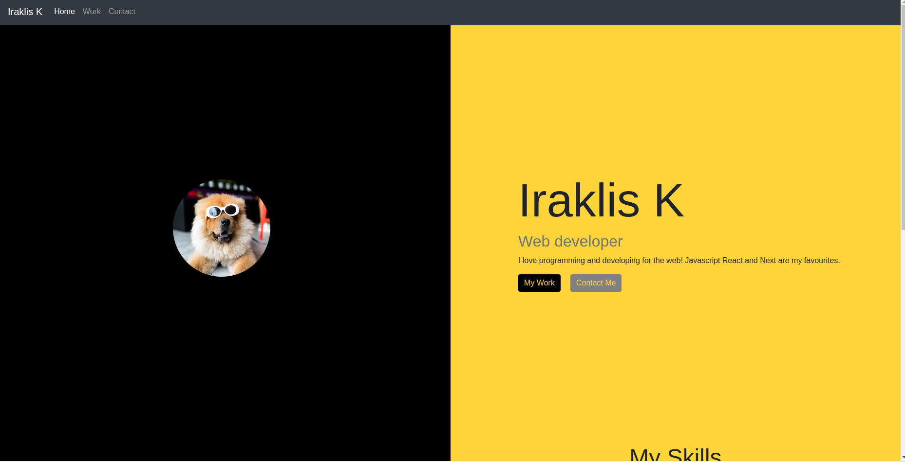
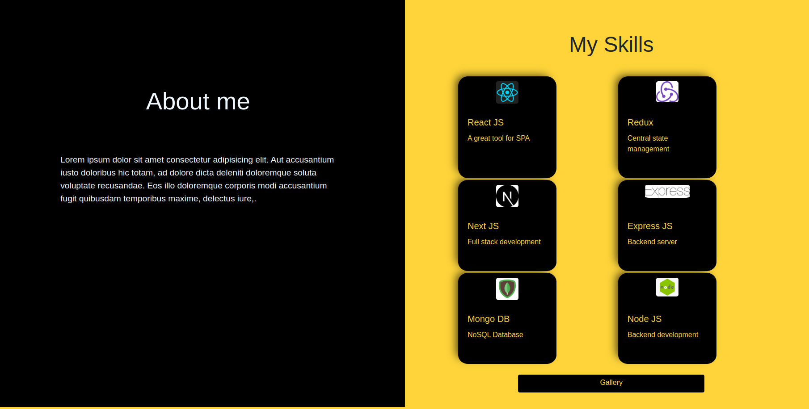
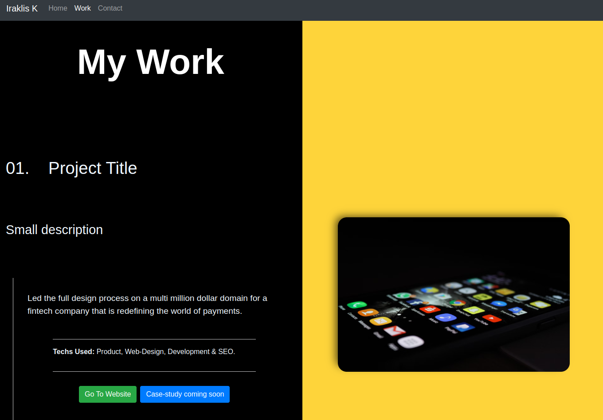
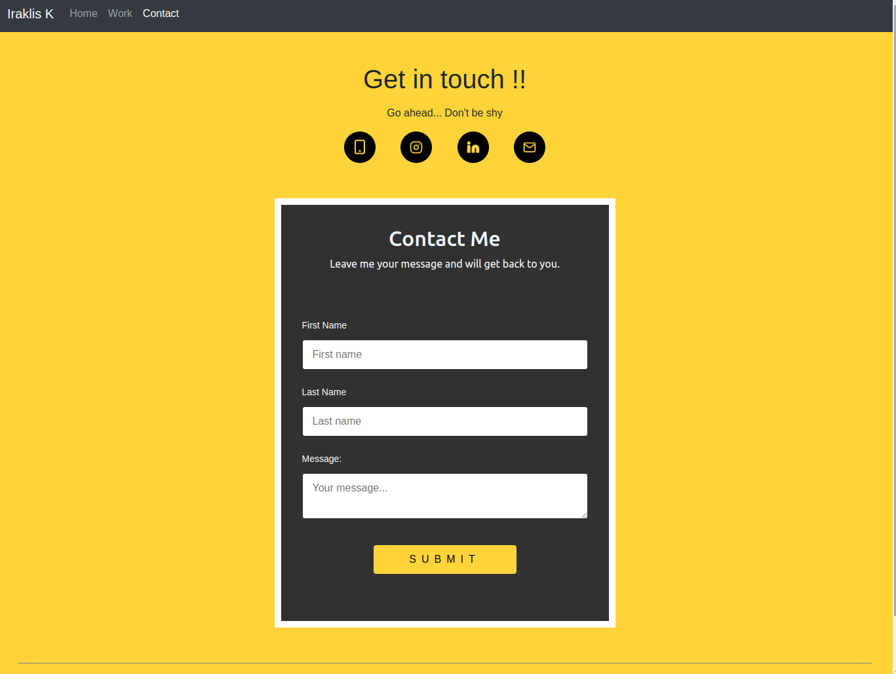
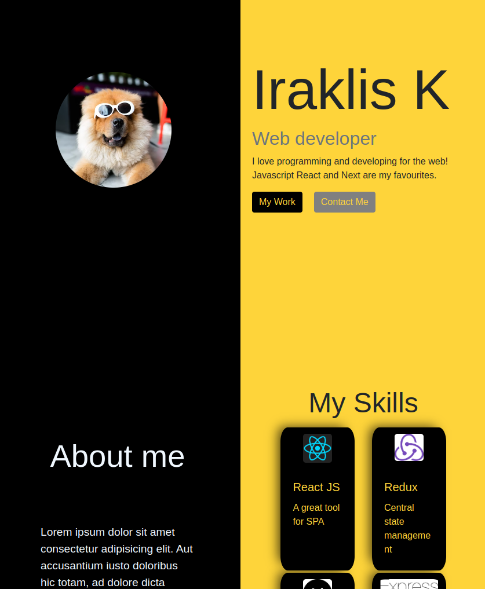
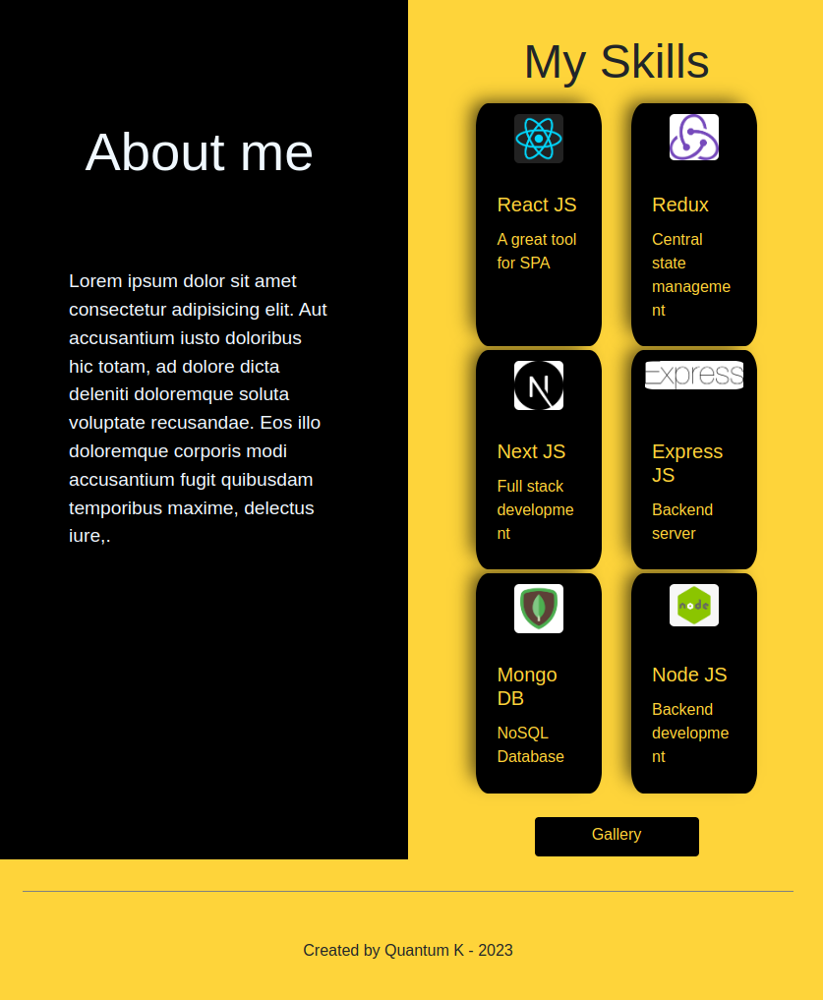
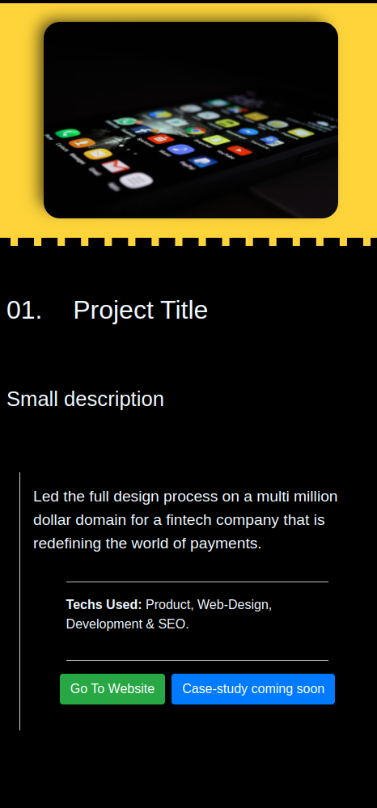
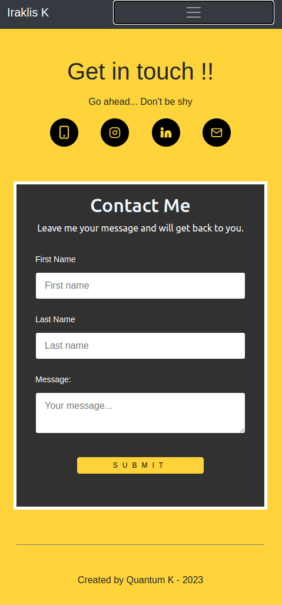

# React Portfolio

## Description
This is an attempt to create a portfolio website with React. Unfortunately due to time constraints and really busy final 2 weeks, it is not completed yet. 

Nevertheless, the main structure and routes of the website are completed along with the basic styles and responsiveness. 

Most of the content is still mock content, like information about me and projects displayed. It is meant to be completed shortly in the upcoming days but sadly not within the time frame of the bootcamp. Things that need finishing are: Real content and personal info added, navbar transparency and width adjustment, responsiveness of main page, content of form to be handled with a backend.

Technologies used: React, React Router, React-Hook-Form, Bootstrap 4. 


## Table of contents
- [React Portfolio](#react-portfolio)
  - [Description](#description)
  - [Table of contents](#table-of-contents)
  - [Installation](#installation)
  - [Usage](#usage)
  - [Screenshots](#screenshots)
  - [Contributing](#contributing)
  - [Questions](#questions)
  - [Credits](#credits)
  - [License](#license)


## Installation 

Run the script below to install the app.
```
  npm i 
```


## Usage

Open terminal and run the following to run the app.
```
  npm start
```


## Screenshots










## Contributing

If you want to contribute : 

Contact my github account


## Questions

For any questions or requests : [https://github.com/QuantumK9/react-portfolio](https://https://github.com/QuantumK9/react-portfolio).

## Credits

Iraklis K


## License 

MIT License

[](https://opensource.org/licenses/MIT)
  
